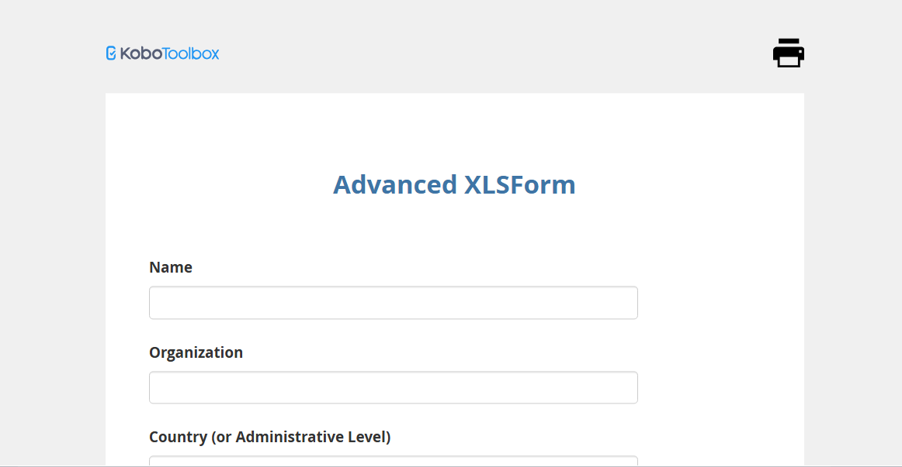
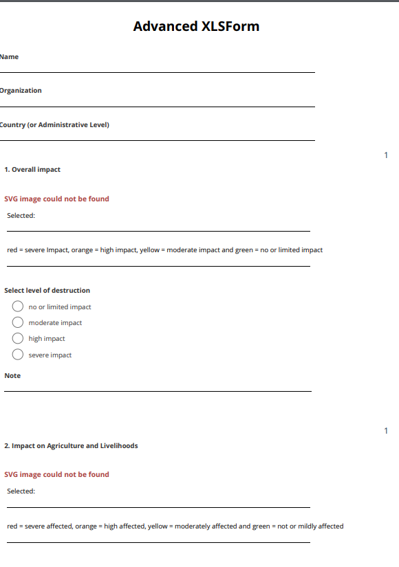

# KoboToolbox Survey Form – Advanced XLSForm Example

This repository contains a sample **XLSForm** used for simulating advanced digital surveys using [KoboToolbox](https://www.kobotoolbox.org/). The form demonstrates:
- Skip logic
- Validation constraints
- GPS tagging
- Select-one/multiple options
- Repeating groups

## 📄 Form File
- [`Advanced_XLSForm.xlsx`](./Advanced_XLSForm.xlsx)

## 🖼️ Preview

### 1. Form Preview on KoboToolbox:

### 2. Sample Submission Screen:

## 🚀 How to Use

1. Go to [KoboToolbox](https://kf.kobotoolbox.org/).
2. Upload the `Advanced_XLSForm.xlsx` file.
3. Deploy the form and start collecting simulated data.

## 📌 Tools Used
- KoboToolbox
- XLSForm
- GitHub

## 📬 License
MIT License
